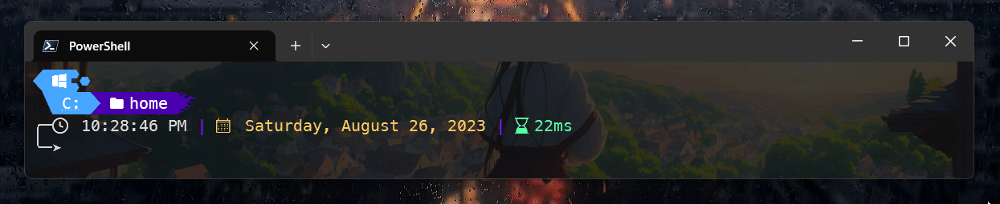

# TridLines

# Getting Started
If you're new using a custom theme, you need to install the [Oh My Posh](https://ohmyposh.dev/docs/installation/windows) and follow the instructions.

Now, if you want to use the TridLines theme, the JSON file is located in the [themes](./themes/) folder.

# Recommended Fonts
- FiraCode Nerd Font
- MesloLGM Nerd Font
